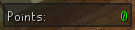

# Tithe Farm Improved - v0.4
Improve overall experience for Tithe farm.

## Plants progress
* Shows progress of dry plants with game-tick precision
* Shows progress of watered plants with game-tick precision
* Shows progress of grown plants with game-tick precision
* Shows progress of blighted plants with game-tick precision
* Highlights farm patch on mouse over

 

## Inventory highlights
* Highlights seeds

 

## Points widget
* Shows total points
* Show how many points will be added this run

 

## Settings

 

## Ground markers
Ground markers to do 25 plants per run can be found from [here](./groundmarkers.txt). 

