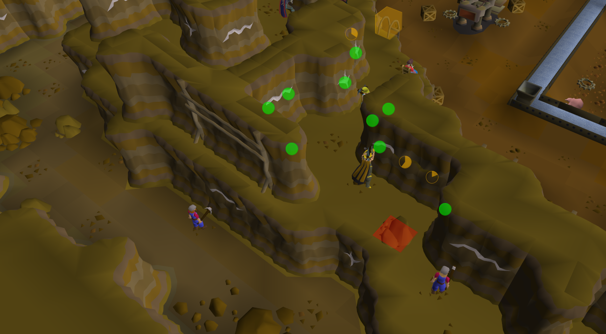
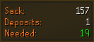

# Motherlode Mine Improved - v0.4.1

 

## Features
* Highlight available/depleted ore veins with progress timers.
* Highlight ore veins when they shouldn't be mined.
* Notify when you no longer need to mine to make sure sack doesn't become to full.
* Highlight rockfalls.
* Upstairs is mapped to sections to only show the veins in your section.

 

## Custom widget
* Show how many golden nuggets you have in total and/ord found this session.
* Show how many pay-dirt is stored (sack and hopper combined).
* Show how many deposits are needed before the sack gets full.
* Show how many pay-dirt you need to mine before depositing.
* Change background color based on the action you need to do.

 

## Config
